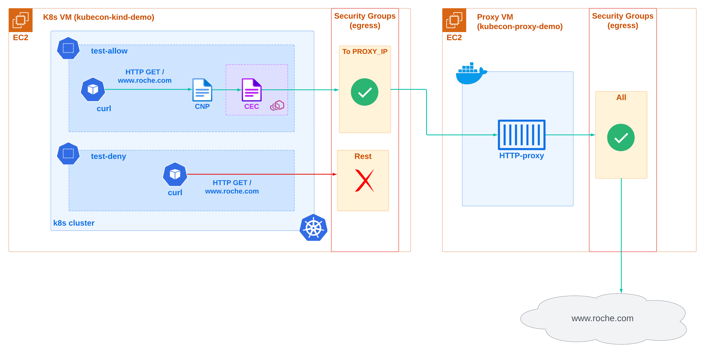

# [Demo] Meshing it Up Securely: How Roche Manages Network Connectivity for 1000+ Edge Clusters

This repository contains the code for this demo presented at KubeCon 2024 by [Roche](https://www.roche.com/).

## What is this demo about?

The purpose of this demo is to demonstrate how to use some advanced `Cilium Service Mesh` networking features.

We will focus on the following scenario:

> We have one kubernetes cluster running on a server that has egress traffic restricted only allowing as destination the IP of another server that is running a HTTP proxy. The proxy's egress traffic is enabled to any destination. We want to ensure that egress traffic from the kuberentes cluster to an specific destination is routed through the proxy, so that it can reach that destination.

## Prerequisites

In order to follow along with this demo, you will need the following:

* An AWS account where you can create resources
* [terraform](https://developer.hashicorp.com/terraform/tutorials/aws-get-started/install-cli) installed
* [j2cli](https://github.com/kolypto/j2cli) installed
* [kubectl](https://kubernetes.io/docs/tasks/tools/) installed
* [python 3.11](https://www.python.org/downloads/) installed

## Setting up the demo environment



### Step 1: Create all the resources

First of all, go to `terraform` directory and create the resources:

```bash
cd terraform
terraform init
terraform apply
```

This will create the following resources:

* An EC2 instance named `kubecon-kind-demo` running a `kind` kubernetes cluster where `Cilium` is configured as the CNI with `CiliumEnvoyConfig` CRD enabled. Two namespaces named `test-allow` and `test-deny` are also created, each with a `curl` pod running for further testing later on.
* An EC2 instance named `kubecon-proxy-demo` running a HTTP proxy server as a Docker container on port `3128`.

By default, both EC2 instances are configured with a security group that allows all egress traffic, but only allows incoming traffic from the IP of the machine that created the resources via ssh port `22`. Additionally, the `kubecon-proxy-demo` EC2 instance allows incoming traffic from `kubecon-kind-demo` EC2 instance's public ip to port `3128`.

> **INFO:** if your laptop's IP changes, just execute again `terraform apply` again so that the security group rules of the EC2 instances are updated to allow incoming traffic from your new IP.

### Step 2: Restrict kubernetes server egress traffic

> **WARN:** wait for the `kubecon-kind-demo` server to complete its initial cloud-init deployment before continue. You can check if the server is ready executing this `Makefile` target from the root folder of this repository: `make check_ec2_kind_ready`.

Now, we need to restrict all egress traffic from `kubecon-kind-demo` EC2 instance.
We will do this by updating the security group of the `kubecon-kind-demo` EC2 instance to only allow egress traffic to the public IP of the `kubecon-proxy-demo` EC2 instance on port `3128` where the HTTP proxy is exposed.

Edit the `terraform/ec2_kind.tf` file and comment out the `egress_with_cidr_blocks` under `######### Allow ALL egress traffic`, and uncomment the `egress_with_cidr_blocks` under `####### Allow ONLY egress traffic to the EC2 Proxy (+ DNS and NTP)`.

Then, apply the changes:

```bash
terraform apply
```

## Execute the demo

### Step 1: Deploy Cilium Service Mesh custom resources

At this point, the kubernetes cluster cannot connect to any external destination.

Let's enable egress traffic to `*.roche.com` only in namespace `test-allow`.

For this purpose, execute the following command from the root folder of this repository:

```bash
cd ..
make apply_manifests
```

This `Makefile` target will deploy the following custom resources:

* **cec_proxy.yaml**: A `CiliumEnvoyConfig (cec)` in the `test-allow` namespace that will route all traffic that arrives to it through the `public_ip:port` of the HTTP proxy server running on `kubecon-proxy-demo` EC2 instance.
* **cnp_proxy.yaml**: A `CiliumNetworkPolicy (cnp)` that allows all traffic from any pod in the `test-allow` namespace to `*.roche.com` and redirects it to the `envoy listener` defined in that `cec`.

But before, it will perform the following actions:

* Get the public ip of the `kubecon-proxy-demo` EC2 instance from the terraform state.
* Generate the file `cec_proxy.yaml` (which defines the `CiliumEnvoyConfig` custom resource) from `cec_proxy.j2` template using `j2cli` jinja cli, setting the `kubecon-proxy-demo` EC2 instance public ip as backend for the envoy cluster.
* Download the kubeconfig file `kubecon-kind-demo.config` via ssh from the `kubecon-kind-demo` EC2 instance and save it to the `terraform` folder.
* Expose kube-apiserver port `6443` of the `kubecon-kind-demo` EC2 instance to your localhost port `6443` via an ssh tunnel, so that you can use `kubectl` from your laptop. (See [Connect to kube-apiserver](#connect-to-kube-apiserver)).

### Step 2: Monitor the HTTP proxy logs

In a separate terminal, let's monitor the logs of the HTTP proxy running on `kubecon-proxy-demo` EC2 instance.

You have the ssh command to connect to the `kubecon-proxy-demo` EC2 instance on the terraform outputs, but you can also get it by executing:

```bash
make show_ec2_proxy_ssh
```

Once you get it, execute it to connect to the server. It will be something similar to:

```bash
ssh -i terraform/id_rsa ubuntu@x.x.x.x
```

Now that you are connected to the server, execute the following command to monitor the logs of the HTTP proxy:

```bash
docker logs $(docker ps --format '{{.ID}}') -f
```

Keep this terminal open to monitor the logs of the HTTP proxy. And switch now back to the other terminal.

### Step 3: Test that traffic to `www.roche.com` is not allowed from `test-deny` namespace

Let's send a HTTP request to `www.roche.com` from the `curl` pod running in the `test-deny` namespace:

```bash
make test_deny
```

You should see that the curl request times out:

```bash
000command terminated with exit code 28
```

> **INFO:** in this case, the network traffic corresponding to the `curl` request is being sent directly to the linux netwoking stack, and as there is an AWS security group that only allows egress traffic to the `kubecon-proxy-demo` EC2 instance public ip and denies all the rest, the request cannot reach roche's ip.

### Step 4: Test that traffic to `www.roche.com` is allowed from `test-allow` namespace

Now let's send a HTTP request to `www.roche.com` from the `curl` pod running in the `test-allow` namespace, where the `CiliumEnvoyConfig` and `CiliumNetworkPolicy` are deployed:

```bash
make test_allow
```

This time you should get an HTTP `200` response, meaning that the request was successful.

> **INFO:** in this case, the `CiliumNetworkPolicy` not only allows the traffic to `www.roche.com` but also instead of sending it to the linux networking stack, redirects it to the envoy listener defined in the `CiliumEnvoyConfig`, and there envoy routes the traffic to the proxy running on `kubecon-proxy-demo` EC2 instance using `HTTP CONNECT` method.

Move back to the terminal where you are monitoring the logs of the HTTP proxy.
You should see a log message for the request that the proxy received and routed to `www.roche.com`, similar to this:

```logs
{"time_unix":1707585823, "proxy":{"type:":"PROXY", "port":3128}, "error":{"code":"00000"}, "auth":{"user":"-"}, "client":{"ip":"3.123.33.107", "port":38522}, "server":{"ip":"142.250.185.228", "port":443}, "bytes":{"sent":844, "received":5871}, "request":{"hostname":"142.250.185.228"}, "message":"CONNECT 142.250.185.228:443 HTTP/1.1"}
```

## Clean up

Once you are done with the demo, you can clean up all the resources by executing the following:

```bash
cd terraform
terraform destroy
```

## Appendix

### Connect to kube-apiserver

Incomming traffic to all the EC2 instances is restricted to the IP of the machine that created the resources via ssh port 22. If you want to use `kubectl` to connect to the `kube-apiserver`, you will need to create a ssh tunnel to the `kubecon-kind-demo` EC2 instance.

For this purpose, execute the following command:

```bash
make connect_apiserver
```

> **INFO:** if it fails, you probably already executed it and the tunnel is already established. For example, be aware that the `Makefile` target `make apply_manifests` executes `make connect_apiserver` as a dependency.

Once you have the tunnel established, you can use `kubectl` normally from your laptop to interact with the kubernetes cluster.

You might need to export the `KUBECONFIG` environment variable to point to the kubeconfig file of the `kind` cluster.

```bash
export KUBECONFIG=terraform/kubecon-kind-demo.config
```

### Disconnect from kube-apiserver

The tunnel is established with an ssh process that runs in background mode exposing port `6443` of the `kubecon-kind-demo` EC2 instance to your localhost port `6443`.
Once you are done with your testing, you can kill the process to free up port `6443` by executing the following command:

```bash
make disconnect_apiserver
```
